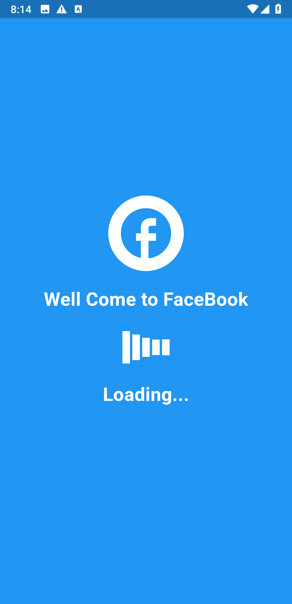
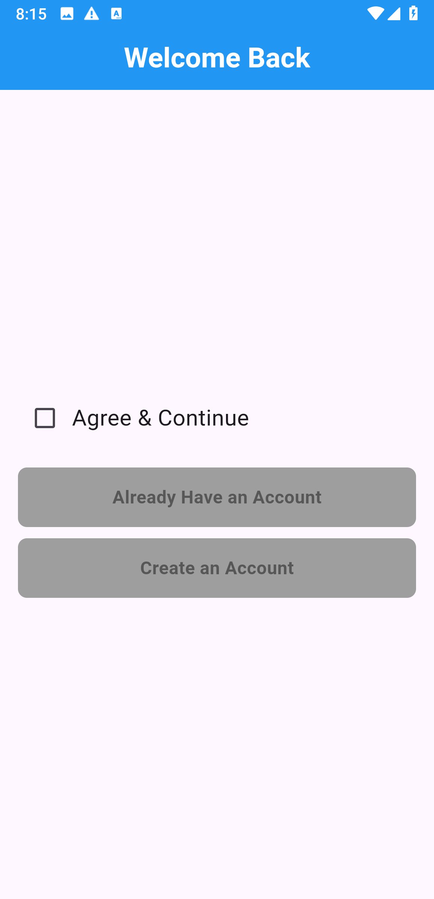
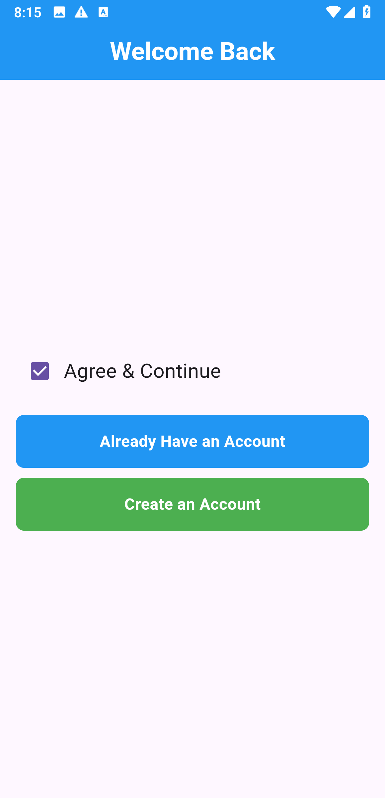
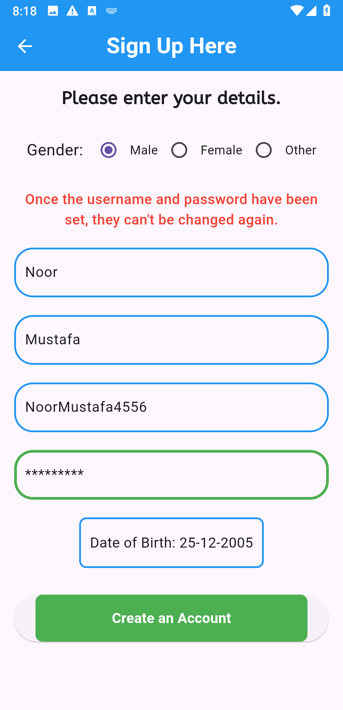
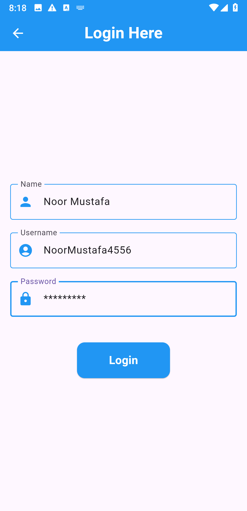
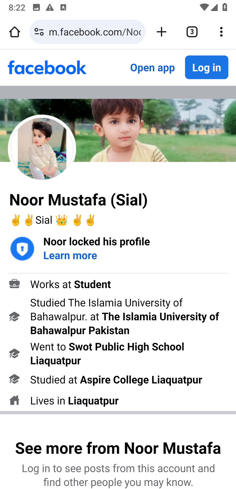

# 📱 Facebook-Style Login UI - Flutter App

A Flutter-based mobile application that simulates a simplified **Facebook-like onboarding and login experience**, ideal for learning and demonstration purposes. This app includes a splash screen, an agreement screen, a user registration form, and a login form that integrates with external links using the `url_launcher` package.

---


## 📸 App Screenshots


<p align="center">
  
  
  
  
  
  
</p>


## 🚀 Features

### 🔹 Splash Screen
-   Facebook-style circular icon.
-   Animated loading indicator using `flutter_spinkit` (`SpinKitWave`).
-   Automatically navigates to the next screen after 5 seconds.

### 🔹 Agreement Screen (`FScreen1`)
-   A mandatory checkbox to "Agree & Continue".
-   The "Create New Account" and "Log In" buttons are disabled until the user agrees to the terms.

### 🔹 Signup Page (`FSignup`)
-   User-friendly form for creating a new account.
-   Gender selection (Male, Female, Other) using radio buttons.
-   Date of Birth selection with a native date picker.
-   Input fields for First Name, Last Name, Username, and Password.
-   A clear warning that the username and password cannot be changed later.
-   A simulated loading indicator upon account creation to mimic a network request.

### 🔹 Login Page (`FLogin`)
-   Simple and clean login form with fields for Username and Password.
-   Upon successful login, the app uses the `url_launcher` package to open an actual Facebook profile in the device's default browser.

---


## 🛠️ Tech Stack & Key Packages

-   **Framework:** [Flutter](https://flutter.dev/)
-   **Language:** [Dart](https://dart.dev/)
-   **Key Packages:**
    -   [`url_launcher`](https://pub.dev/packages/url_launcher): For opening external URLs in a browser.
    -   [`flutter_spinkit`](https://pub.dev/packages/flutter_spinkit): For beautiful loading animations.
    -   [`intl`](https://pub.dev/packages/intl): For date formatting.

---

## ⚙️ Getting Started

Follow these instructions to get a copy of the project up and running on your local machine for development and testing.

### Prerequisites

Make sure you have Flutter SDK installed on your machine. For help, check the official [Flutter installation guide](https://flutter.dev/docs/get-started/install).

### Installation & Setup

1.  **Clone the repository**
    ```bash
    git clone https://github.com/NoorMustafa4556/FaceBook-Login-Method.git
    ```

2.  **Navigate to the project directory**
    ```bash
    cd FaceBook-Login-Method
    ```

3.  **Install the dependencies**
    ```bash
    flutter pub get
    ```

4.  **Run the app**
    ```bash
    flutter run
    ```

---

## 🤝 Contributing

Contributions are what make the open-source community such an amazing place to learn, inspire, and create. Any contributions you make are **greatly appreciated**.

1.  Fork the Project
2.  Create your Feature Branch (`git checkout -b feature/AmazingFeature`)
3.  Commit your Changes (`git commit -m 'Add some AmazingFeature'`)
4.  Push to the Branch (`git push origin feature/AmazingFeature`)
5.  Open a Pull Request

---
# 👋 Hi, I'm Noor Mustafa

A passionate and results-driven **Flutter Developer** from **Bahawalpur, Pakistan**, specializing in building elegant, scalable, and high-performance cross-platform mobile applications using **Flutter** and **Dart**.

With a strong understanding of **UI/UX principles**, **state management**, and **API integration**, I aim to deliver apps that are not only functional but also user-centric and visually compelling. My development approach emphasizes clean code, reusability, and performance.

---

## 🚀 What I Do

- 🧑‍💻 **Flutter App Development** – I build cross-platform apps for Android, iOS, and the web using Flutter.
- 🔗 **API Integration** – I connect apps to powerful RESTful APIs and third-party services.
- 🎨 **UI/UX Design** – I craft responsive and animated interfaces that elevate the user experience.
- 🔐 **Authentication & Firebase** – I implement secure login systems and integrate Firebase services.
- ⚙️ **State Management** – I use Provider, setState, and Riverpod (in-progress) for scalable app architecture.
- 🧠 **Clean Architecture** – I follow MVVM and MVC patterns for maintainable code.

---


## 🌟 Projects I'm Proud Of

- 🌤️ **[Live Weather Check App](https://github.com/NoorMustafa4556/Live-Weather-Check-App)** – Real-time weather forecast using OpenWeatherMap API  
- 🤖 **[AI Chatbot (Gemini)](https://github.com/NoorMustafa4556/Ai-ChatBot)** – Conversational AI chatbot powered by Google’s Gemini  

- 🍔 **[Recipe App](https://github.com/NoorMustafa4556/Recipe-App)** – Discover recipes with images, categories, and step-by-step instructions  

- 📚 **[Palindrome Checker](https://github.com/NoorMustafa4556/Palindrome-Checker-App)** – A Theory of Automata-based project to identify palindromic strings  

> 🎯 Check out all my repositories on [github.com/NoorMustafa4556](https://github.com/NoorMustafa4556?tab=repositories)

---

## 🛠️ Tech Stack & Tools

| Area                | Tools/Technologies |
|---------------------|--------------------|
| **Languages**       | Dart, JavaScript, Python (basic) |
| **Mobile Framework**| Flutter            |
| **Backend/Cloud**   | Firebase (Auth, Realtime DB, Storage), Django, Flask |
| **Frontend (Web)**  | React.js (basic), HTML, CSS, Bootstrap |
| **State Management**| Provider, setState, Riverpod (learning) |
| **API & Storage**   | REST APIs, HTTP, Shared Preferences, SQLite |
| **Design**          | Material, Cupertino, Lottie Animations, Gradient UI |
| **Version Control** | Git, GitHub        |
| **Tools**           | Android Studio, VS Code, Postman, Figma (basic) |

---

## 🧰 Tech Toolbox

<p align="left">
  
  
  
  
  
  
  
  
</p>

---

## 📈 Current Focus

- 💡 Enhancing Flutter animations and transitions
- 🤖 Implementing AI-based logic with Google Gemini API
- 📲 Building portfolio-level applications using full-stack Django & Flutter

---

## 📫 Let's Connect!

<p align="left">
  <a href="https://x.com/NoorMustafa4556" target="blank">
    
  </a>
  <a href="https://www.linkedin.com/in/noormustafa4556/" target="blank">
    
  </a>
  <a href="https://www.facebook.com/NoorMustafa4556" target="blank">
    
  </a>
  <a href="https://instagram.com/noormustafa4556" target="blank">
    
  </a>
  <a href="https://wa.me/923087655076" target="blank">
    
  </a>
  <a href="https://www.tiktok.com/@noormustafa4556" target="blank">
    
  </a>
</p>

- 📍 **Location:** Bahawalpur, Punjab, Pakistan

---

> _“Learning never stops. Every app I build makes me a better developer — one widget at a time.”_

---


